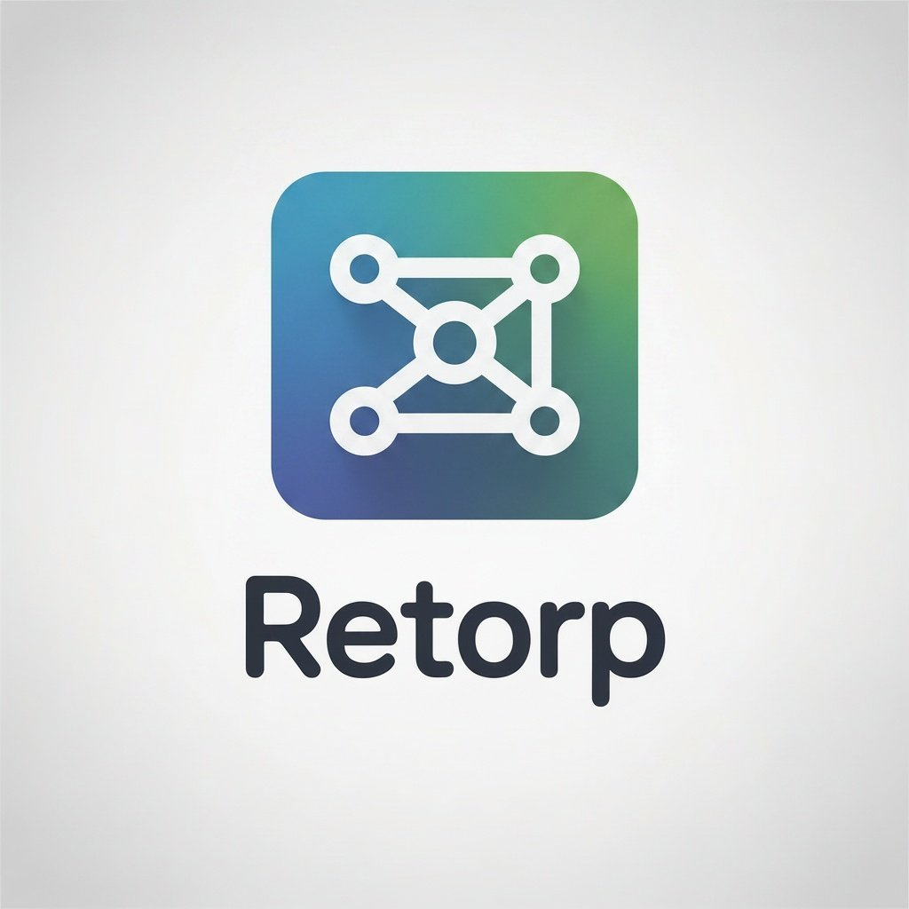

<div align="center">



# Retorp — Network Monitor

### Monitor de red local para Windows · Sin instalación · Sin cuenta

*Escaneo ARP · Detección de dispositivos · Puertos · Latencia · Historial*

---


</div>

---

## ¿Qué es Retorp?

**Retorp** es una herramienta de escritorio para Windows que escanea tu red local en tiempo real. Detecta todos los dispositivos conectados a tu red WiFi, muestra sus direcciones MAC, fabricante, puertos abiertos y latencia. Funciona completamente offline — sin cuentas, sin servidores externos, sin internet.

---

## Características

| | Función | Descripción |
|:---:|---|---|
| 🔍 | **Escaneo ARP** | Detecta todos los dispositivos en tu red local |
| 📡 | **Info de dispositivos** | IP, MAC, fabricante, nombre de host |
| 🔓 | **Puertos abiertos** | Escaneo de puertos con Nmap integrado |
| ⚡ | **Latencia** | Ping en tiempo real a cada dispositivo |
| 📊 | **Estadísticas** | Gráficas de uso y dispositivos por sesión |
| 📁 | **Historial** | Registro de dispositivos detectados con fecha |
| 🌗 | **Tema claro/oscuro** | Cambia entre temas con un clic |
| 💾 | **Offline** | Base de datos SQLite local, sin nube |

---

## ⬇️ Descarga para usuarios

> No necesitas instalar Python ni ningún programa adicional.

1. Ve a [**Releases**](../../releases)
2. Descarga **`RetorpSetup_v1.0.0.exe`**
3. Ejecuta el instalador y abre **`Retorp`** desde el escritorio

### ⚠️ SmartScreen de Windows

Si Windows muestra *"aplicación desconocida"* → clic en **"Más información" → "Ejecutar de todas formas"**. Retorp no tiene firma de código de pago, pero el código fuente es 100% público y verificable aquí en GitHub.

### 🔴 Falso positivo de antivirus

Algunos antivirus pueden marcar el ejecutable como sospechoso. **Retorp no es malware.**

**¿Por qué ocurre?**
Los ejecutables compilados localmente sin firma de distribución comercial pueden disparar heurísticos de machine learning en algunos antivirus. Es un falso positivo documentado que afecta a muchas aplicaciones de código abierto sin firma de código.

**Solución:**
- Agrega `retorp.exe` a las exclusiones de tu antivirus
- Verifica el código fuente directamente aquí en el repositorio — es completamente público
- Si quieres mayor confianza, compílalo tú mismo desde el código fuente (ver sección de desarrolladores)

---

## Cómo usar Retorp

```
1. Ejecuta start.bat para iniciar el backend
2. La interfaz abre automáticamente
3. Clic en "Escanear" para detectar dispositivos en tu red
4. Clic en cualquier dispositivo para ver detalles: MAC, fabricante, puertos
5. La pestaña Historial muestra escaneos anteriores
6. La pestaña Estadísticas muestra gráficas de actividad
```

> ⚠️ El escaneo ARP requiere ejecutar como **Administrador** para mejores resultados.

---

## Para desarrolladores

### Requisitos

| Herramienta | Versión | Link |
|---|---|---|
| **Python** | 3.12+ | https://python.org/downloads |
| **Flutter SDK** | 3.x | https://docs.flutter.dev/get-started/install/windows/desktop |
| **Nmap** | Cualquiera | https://nmap.org/download |
| **Windows** | 10 / 11 (64-bit) | — |

### Ejecutar en modo desarrollo

```cmd
git clone https://github.com/TU_USUARIO/retorp.git
cd retorp
start.bat
```

### Compilar el ejecutable

```cmd
cd frontend\netmonitor_app
flutter pub get
flutter build windows --release
```

El ejecutable queda en:
```
frontend\netmonitor_app\build\windows\x64\runner\Release\retorp.exe
```

### Generar instalador

1. Instala [Inno Setup](https://jrsoftware.org/isinfo.php)
2. Abre `installer\retorp_installer.iss`
3. Clic en **Compile**
4. El instalador queda en `dist\RetorpSetup_v1.0.0.exe`

---

## Estructura del proyecto

```
netmonitor/
├── backend/
│   ├── main.py            ← API FastAPI
│   ├── scanner.py         ← Lógica ARP + Nmap + Ping
│   ├── database.py        ← SQLite / historial
│   ├── models.py          ← Modelos de datos
│   └── requirements.txt
├── frontend/
│   └── netmonitor_app/
│       ├── lib/
│       │   ├── main.dart
│       │   ├── models/    ← Dispositivo
│       │   ├── screens/   ← Home, Detalle, Historial, Estadísticas
│       │   ├── services/  ← API, Red, Tema
│       │   └── widgets/   ← Cards, Stats
│       └── pubspec.yaml
├── installer/
│   └── retorp_installer.iss
├── build_release.bat      ← Compila el .exe
├── start.bat              ← Inicia backend + frontend
└── README.md
```

---

## Stack técnico

| Capa | Tecnología | Rol |
|---|---|---|
| Backend | Python + FastAPI | API REST local |
| Escaneo | Scapy + Nmap | ARP scan + puertos |
| Frontend | Flutter (Windows) | Interfaz de usuario |
| Base de datos | SQLite | Historial local |
| Empaquetado | Inno Setup | Instalador Windows |

---

<div align="center">

Construido con Python y Flutter · Windows 10/11 · Sin dependencias externas

</div>
